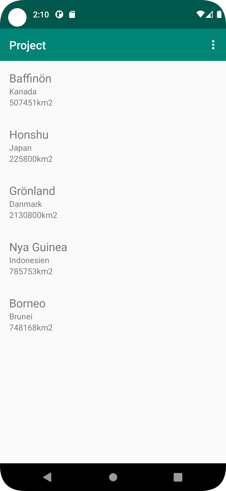

# Rapport

**Skriv din rapport här!**

1. Added a recycler view to the main layout file 

```
<androidx.recyclerview.widget.RecyclerView
        android:id="@+id/recyclerView"
        android:layout_width="match_parent"

        android:layout_height="wrap_content"
        app:layout_constraintTop_toBottomOf="@+id/appBarLayout" />

```
2. Created a new resource file for my list items and added 3 text views and a card view
The 3 text views are used to represent the different values from the islands class.
   
```

    <androidx.cardview.widget.CardView
        android:layout_width="match_parent"
        android:layout_height="wrap_content"

        />
    <LinearLayout

        android:orientation="vertical"
        android:padding="16dp"
        android:layout_width="match_parent"
        android:layout_height="wrap_content"
        >
        <TextView
            android:id="@+id/textView"
            android:layout_width="match_parent"
            android:layout_height="wrap_content"
            android:text="TextView 1"
            android:textSize="20sp"
            />
        <TextView
            android:id="@+id/textView2"
            android:layout_width="match_parent"
            android:layout_height="wrap_content"
            android:layout_weight="1"
            android:text="TextView 2" />

        <TextView
            android:id="@+id/textView3"
            android:layout_width="match_parent"
            android:layout_height="wrap_content"
            android:text="TextView 3" />
    </LinearLayout>

```
3. I created a class to represent my items(Islands) and an Adapter class for the recycler view.
The Islands class has 3 private variables, a constructor and setter/getter methods to access the data. 
   
```
public class Islands {
    private String name;
    private String location;
    private int size;

    public Islands(String name, String location, int size) {
        this.name = name;
        this.location = location;
        this.size = size;
    }

    public String getName() {
        return name;
    }

    public void setName(String name) {
        this.name = name;
    }


    public String getLocation() {
        return location;
    }

    public void setLocation(String location) {
        this.location = location;
    }

    public int getSize() {
        return size;
    }

    public void setSize(int size) {
        this.size = size;
    }


}
```
The adapter class has 3 methods and an internal ViewHolder class. 
The getItemCount() count returns how many items we have in our list as an integer. In the ViewHolder class we create our views that we later 
we bind in the OnBindViewHolder() method. The OnCreateViewholder method is responsible for inflating our list_item resource file. 

```
public class Adapter  extends RecyclerView.Adapter<Adapter.ViewHolder>{
    List<Islands> islandsList;

    public Adapter(List<Islands> islandsList) {
        this.islandsList = islandsList;
    }

    @NonNull
    @Override
    public Adapter.ViewHolder onCreateViewHolder(@NonNull ViewGroup parent, int viewType) {
        View view = LayoutInflater.from(parent.getContext()).inflate(R.layout.list_items, parent, false);

        return new ViewHolder(view);
    }

    @Override
    public void onBindViewHolder(@NonNull Adapter.ViewHolder holder, int position) {
        holder.name.setText(islandsList.get(position).getName());
        holder.location.setText(islandsList.get(position).getLocation());
        holder.size.setText(islandsList.get(position).getSize()+"km2");

    }
    @Override
    public int getItemCount() {
        return islandsList.size();
    }

    public class ViewHolder extends RecyclerView.ViewHolder {
        private TextView name,location,size;
        public ViewHolder(@NonNull View itemView) {
            super(itemView);
            name = itemView.findViewById(R.id.textView);
            location = itemView.findViewById(R.id.textView2);
            size = itemView.findViewById(R.id.textView3);
        }
    }
}

```
4. Copied the JsonTask class from github into my application and made it so that the main activity class implements it. 

5. In MainActivity i created my recycler view, Adapter, and List of objects. Also created a string for the json URL that holds the json data.
   
- I set the the adapter to the recycler view
- set the layout manager
- in the OnPostExecute method, created a Gson object to unmarshall the Json data and populated the list. 
- updated the adapter to the new changes. 


```
public class MainActivity extends AppCompatActivity implements JsonTask.JsonTaskListener{
    private List<Islands> islandsList;
    private RecyclerView recyclerView;
    private Adapter adapter;
    private final String JSON_URL = "https://mobprog.webug.se/json-api?login=a18fayha";

    @Override
    protected void onCreate(Bundle savedInstanceState) {
        super.onCreate(savedInstanceState);
        setContentView(R.layout.activity_main);
        Toolbar toolbar = findViewById(R.id.toolbar);
        setSupportActionBar(toolbar);
        islandsList = new ArrayList<>();
        recyclerView = findViewById(R.id.recyclerView);
        LinearLayoutManager linearLayoutManager = new LinearLayoutManager(this);
        adapter = new Adapter(islandsList);
        recyclerView.setLayoutManager(linearLayoutManager);
        recyclerView.setAdapter(adapter);
        

        new JsonTask(MainActivity.this).execute(JSON_URL);

    }

    @Override
    public void onPostExecute(String json) {

        Gson gson = new Gson();
        Type type = new TypeToken<List<Islands>>(){}.getType();
        List<Islands> tmp = gson.fromJson(json,type);
        islandsList.addAll(tmp);
        adapter.notifyDataSetChanged();

    }


```

6. I set the internet permissions in the manifest file to be able to read the external URL

```
 <uses-permission android:name="android.permission.INTERNET" />

```

7. For the about page i decided that i would create a menu with one item. When that item is clicked it starts a new activity. 
And that activity we read in data from an internal file that explains what the application is about. 
   
The menu file: 
```
  <item android:id="@+id/myItem"
        android:title="about page"
        app:showAsAction="never"
        />

```
The method to inflate out menu: 

```
public boolean onCreateOptionsMenu(Menu menu) {
        MenuInflater inflater = getMenuInflater();
        inflater.inflate(R.menu.menu_about, menu);

        return true;
    }

```
Method for when the items is clicked:

```
public boolean onOptionsItemSelected(@NonNull MenuItem item) {
        int id = item.getItemId();
        if(id == R.id.myItem) {
            Intent intent = new Intent(MainActivity.this, AboutActivity.class);
            startActivity(intent);

            return true;
        }
        return super.onOptionsItemSelected(item);
    }

```
8. The about activity xml file has a single web view to show the asset file we created.

```
  <WebView
        android:layout_width="match_parent"
        android:layout_height="match_parent"
        android:id="@+id/myWebView"
        app:layout_constraintBottom_toBottomOf="parent"
        app:layout_constraintLeft_toLeftOf="parent"
        app:layout_constraintRight_toRightOf="parent"
        app:layout_constraintTop_toTopOf="parent" />

```
 
9.In the about activity class i created the web view and linked it to the id in the xml file.
Also implemented a method to read the internal about.html asset file. 

```
public class AboutActivity extends AppCompatActivity {
    private WebView webView;
    
    @Override
    protected void onCreate(Bundle savedInstanceState) {
        super.onCreate(savedInstanceState);
        setContentView(R.layout.activity_about);
        webView = findViewById(R.id.myWebView);
        showAboutPage();
    }
    private void showAboutPage() {
        webView.loadUrl("file:///android_asset/about.html");
    }
    
}

```





